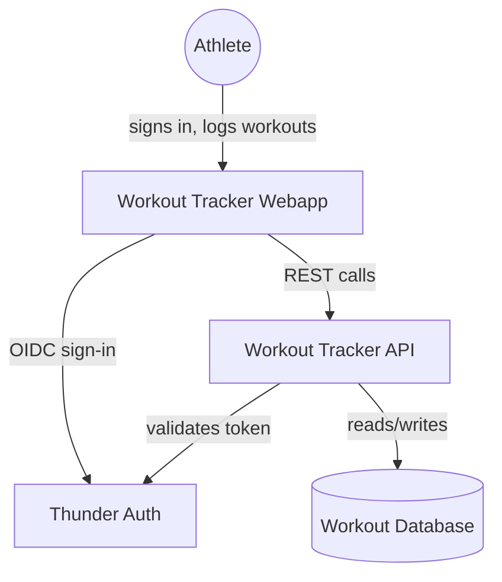
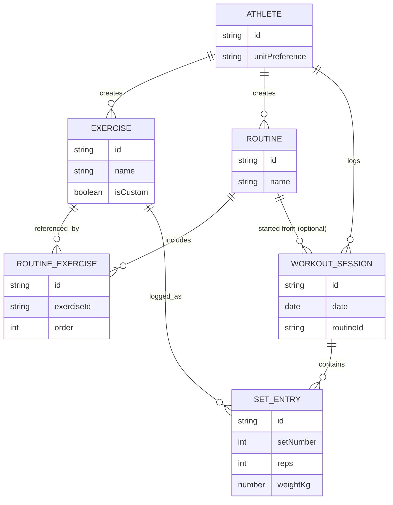
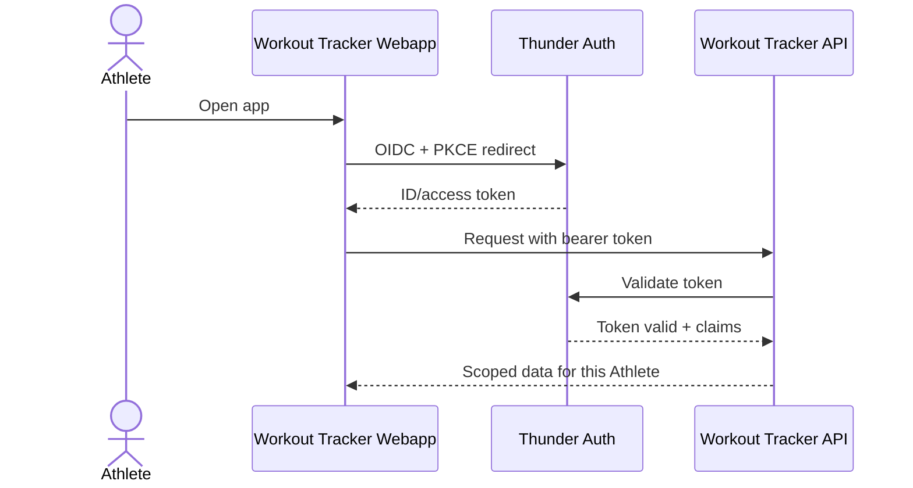
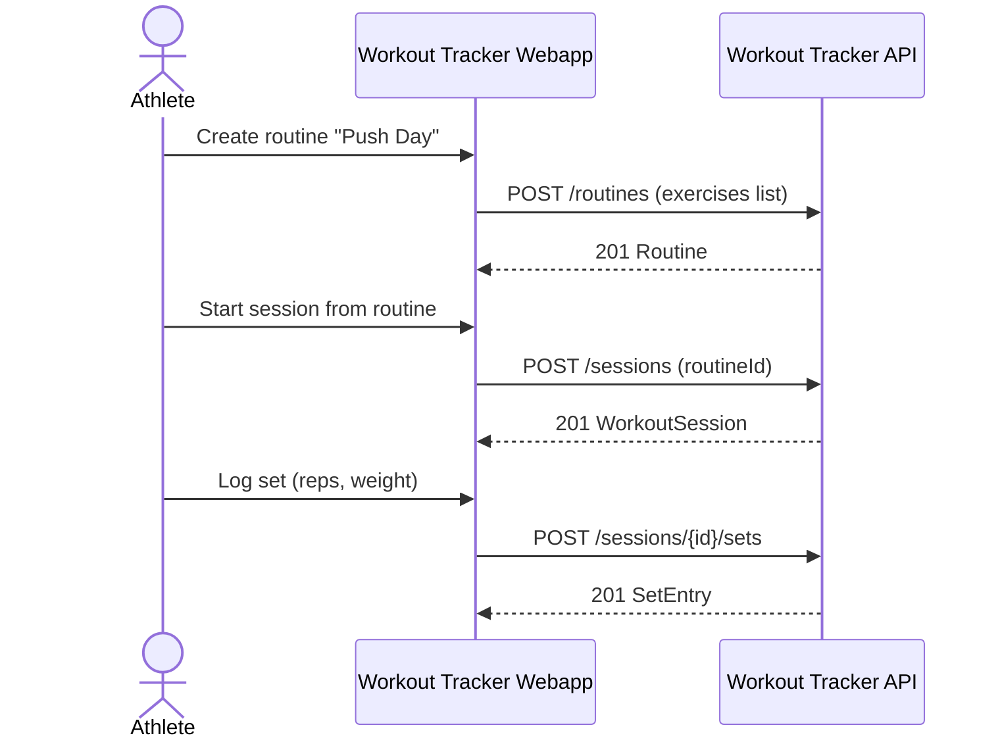
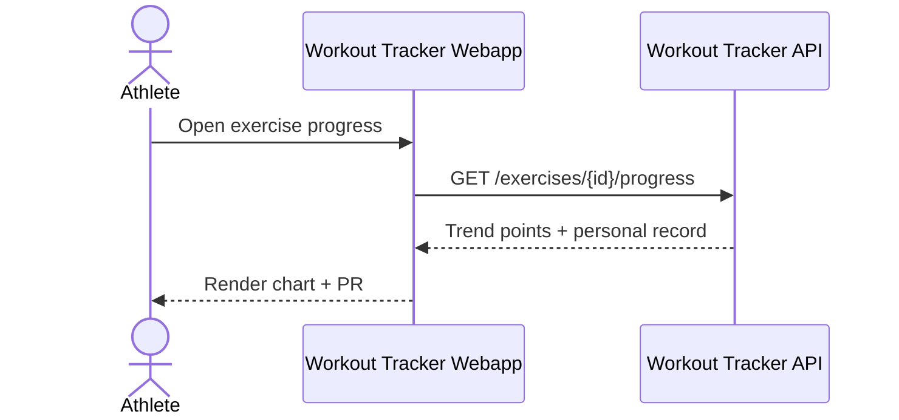

# Gym Workout Tracker — Design

A single-page React app (`workout-webapp`) lets a signed-in Athlete manage routines, log workout sessions and sets, and review progress; it calls a Ballerina API (`workout-api`) that owns all persistence in a dedicated PostgreSQL database and validates every call against Thunder-issued tokens so each Athlete only ever sees their own data.

## Context (C1)

## Domain model (ER)

## Key flows

### Sign-in

### Build a routine and log a session

### Review progress

